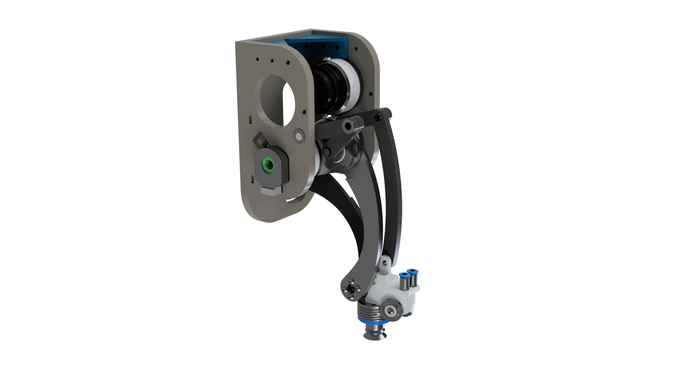

# MASTR BOT

## What is MASTR-BOT ?

MASTR-BOT stands for multi-axis simultaneous transportation system, and is a master's thesis, conducted with Isochronic, on their novel technology.

In this project, user interface has been developped using Typescript (with React.JS + Next.JS). This user interface incorporates a tab that allows the user to edit any parameter of this project, and change the layout of this machine. Additionally, a visualisation tool has been developped to visualize the simulations. The visualisation is not live, but rather reads a json the program wrote. The user can go forward and backward through the simulation, as well as change the play speed.

The entire control software for this project was also fully developped, using Python.

## Installation

This project was made using python 3.10.0.

The libraries required for this project are `ruckig`, `numpy` and `pandas`. If the users wants to visualize the simulation with the python script instead, the old code was kept and uses `matplotlib`.
Finally, the user can install all of the required libraries with

```bash
pip install -r scripts/requirements.txt
```

### How to run the python script

The python script can be launched by running :

```bash
python script/main.py
```

to run it with the default settings, or

```bash
python script/main.py -buidHelper
```

to be guided through the different running parameter.

The different parameters are :

- -pre_move : Activate the premove
- -state_bouncing : Activate the state-bouncing
- -single_run : Make a single simulation run, instead of multiple one
- -save_hist : To save the simulation in a .json. This is necessary to visualize the simulation in the user interface
- -no_csv : Prevent the program from saving the data in a .csv. This is used to analyse the simulation in the jupter notebook
- -name : Name under which to save the .json or the .csv
- -seed : seed to use if required.

### How to run the user interface

To run the user interface, the user needs to install [Node.JS](https://nodejs.org/en).

Then, everything can be installed by running :

```bash
npm install
```

After that, the page can be launched by running :

```bash
npm run dev
```

## In depth look

The goal of this project is to provide a control algorithm for the Isochronic's novel kinematic.
This robot consist of a beam, with a set of rail on each side, and multiple sliders per side. It was programmed have two sliders work together at the same time.


With the current configuration, the layout consists of two conveyors, one for the inflow, and one for the outflow, in a counter-current configuration.

This entire project was also made to be modular. Right now, the conveyors and the beams can be changed with the parameters, to fit the customer's need. However, it has mostly been tested with the current configuration and may present some bugs, which should be reported using a github issue.

Ideally, in a later time, different kind of machine should be usable with this simulation tool, such as delta robots, for instance.

### What does the python script do

The python script runs the simulation offline, according to the specification from `params.json`. Then, it will run, by computing the robot's situation at every time step. It uses [ruckig](https://github.com/pantor/ruckig) as a profile generator. <br />
In the control loop, there is a hierarchical state machine, with the first one being the state of the rails.

Then, and only then, do we look at the state of the sliders, on said beam.
The state machine can get a little complex, this decision flow chart explains the working fundamental of the code, for a slider. As mentionned previously, two sliders always work together, so their states are somewhat linked


An important notion to grasp to understand this code is the first and second slider.
When looking at the list of available targets, we sort the said list using the scheduling. The higher a target is in the list, the higher its priority is. Using the same idea, we can define a first and second slider. The first slider should never ever block the second slider, unless it is picking the last item in a row, in which case the second slider is skipped. Following this logic, if the lowest x-value target is considered the highest priority, then the lowest x-value slider on a rail is considered the first slider.<br />
This is a decision taken to ease the target assignment. Furthermore, the target assignment on the first slider is always permanent. The second isn't. When a target is given to the second slider, only then do we check for collisions, and then decide whether to keep the assigned target or not.<br />
Finally, if only one of the two sliders has been assigned a target at a given timeframe, then the other slider's is set to be positionned next to the assigned slider, in order to avoid any possible collision.

### The state-bouncing

The state-bouncing is an improvement brought to the control algorithm after visually inspecting the simulations. The goal of this method is to prevent idle time when we can by attempting both picking and placing at the same time.
https://github.com/Neiizo/MASTR-BOT/tree/main/img/whystatebouncing.mp4


As seen in the video above, there are scenarios where only one of the two sliders pick a target, and then, we wait for the others to finally find a suitable target. However, in some cases, we may have time to go place the first target, and come back to the current conveyor, before the next one is available. To determine whether we can, we first try to do the current action, here picking, with a larger looking range which simulates a back and forth movement to the other conveyor. Then, if it wasn't succesful, we check whether we can do the other action, which is, here, placing the current target.


<!--
## Getting started

To make it easy for you to get started with GitLab, here's a list of recommended next steps.

Already a pro? Just edit this README.md and make it your own. Want to make it easy? [Use the template at the bottom](#editing-this-readme)!

## Add your files

- [ ] [Create](https://docs.gitlab.com/ee/user/project/repository/web_editor.html#create-a-file) or [upload](https://docs.gitlab.com/ee/user/project/repository/web_editor.html#upload-a-file) files
- [ ] [Add files using the command line](https://docs.gitlab.com/ee/gitlab-basics/add-file.html#add-a-file-using-the-command-line) or push an existing Git repository with the following command:



```
cd existing_repo
git remote add origin http://gitlab.isochronic.com/julien/MASTR-BOT.git
git branch -M main
git push -uf origin main
```

## Integrate with your tools

- [ ] [Set up project integrations](http://gitlab.isochronic.com/julien/MASTR-BOT/-/settings/integrations)

## Collaborate with your team

- [ ] [Invite team members and collaborators](https://docs.gitlab.com/ee/user/project/members/)
- [ ] [Create a new merge request](https://docs.gitlab.com/ee/user/project/merge_requests/creating_merge_requests.html)
- [ ] [Automatically close issues from merge requests](https://docs.gitlab.com/ee/user/project/issues/managing_issues.html#closing-issues-automatically)
- [ ] [Enable merge request approvals](https://docs.gitlab.com/ee/user/project/merge_requests/approvals/)
- [ ] [Automatically merge when pipeline succeeds](https://docs.gitlab.com/ee/user/project/merge_requests/merge_when_pipeline_succeeds.html)

## Test and Deploy

Use the built-in continuous integration in GitLab.

- [ ] [Get started with GitLab CI/CD](https://docs.gitlab.com/ee/ci/quick_start/index.html)
- [ ] [Analyze your code for known vulnerabilities with Static Application Security Testing(SAST)](https://docs.gitlab.com/ee/user/application_security/sast/)
- [ ] [Deploy to Kubernetes, Amazon EC2, or Amazon ECS using Auto Deploy](https://docs.gitlab.com/ee/topics/autodevops/requirements.html)
- [ ] [Use pull-based deployments for improved Kubernetes management](https://docs.gitlab.com/ee/user/clusters/agent/)
- [ ] [Set up protected environments](https://docs.gitlab.com/ee/ci/environments/protected_environments.html)

---

# Editing this README

When you're ready to make this README your own, just edit this file and use the handy template below (or feel free to structure it however you want - this is just a starting point!). Thank you to [makeareadme.com](https://www.makeareadme.com/) for this template.

## Suggestions for a good README

Every project is different, so consider which of these sections apply to yours. The sections used in the template are suggestions for most open source projects. Also keep in mind that while a README can be too long and detailed, too long is better than too short. If you think your README is too long, consider utilizing another form of documentation rather than cutting out information.

## Name

Choose a self-explaining name for your project.

## Description

Let people know what your project can do specifically. Provide context and add a link to any reference visitors might be unfamiliar with. A list of Features or a Background subsection can also be added here. If there are alternatives to your project, this is a good place to list differentiating factors.

## Badges

On some READMEs, you may see small images that convey metadata, such as whether or not all the tests are passing for the project. You can use Shields to add some to your README. Many services also have instructions for adding a badge.

## Visuals

Depending on what you are making, it can be a good idea to include screenshots or even a video (you'll frequently see GIFs rather than actual videos). Tools like ttygif can help, but check out Asciinema for a more sophisticated method.

## Installation

Within a particular ecosystem, there may be a common way of installing things, such as using Yarn, NuGet, or Homebrew. However, consider the possibility that whoever is reading your README is a novice and would like more guidance. Listing specific steps helps remove ambiguity and gets people to using your project as quickly as possible. If it only runs in a specific context like a particular programming language version or operating system or has dependencies that have to be installed manually, also add a Requirements subsection.

## Usage

Use examples liberally, and show the expected output if you can. It's helpful to have inline the smallest example of usage that you can demonstrate, while providing links to more sophisticated examples if they are too long to reasonably include in the README.

## Support

Tell people where they can go to for help. It can be any combination of an issue tracker, a chat room, an email address, etc.

## Roadmap

If you have ideas for releases in the future, it is a good idea to list them in the README.

## Contributing

State if you are open to contributions and what your requirements are for accepting them.

For people who want to make changes to your project, it's helpful to have some documentation on how to get started. Perhaps there is a script that they should run or some environment variables that they need to set. Make these steps explicit. These instructions could also be useful to your future self.

You can also document commands to lint the code or run tests. These steps help to ensure high code quality and reduce the likelihood that the changes inadvertently break something. Having instructions for running tests is especially helpful if it requires external setup, such as starting a Selenium server for testing in a browser.

## Authors and acknowledgment

Show your appreciation to those who have contributed to the project.

## License

For open source projects, say how it is licensed.

## Project status

If you have run out of energy or time for your project, put a note at the top of the README saying that development has slowed down or stopped completely. Someone may choose to fork your project or volunteer to step in as a maintainer or owner, allowing your project to keep going. You can also make an explicit request for maintainers. -->
